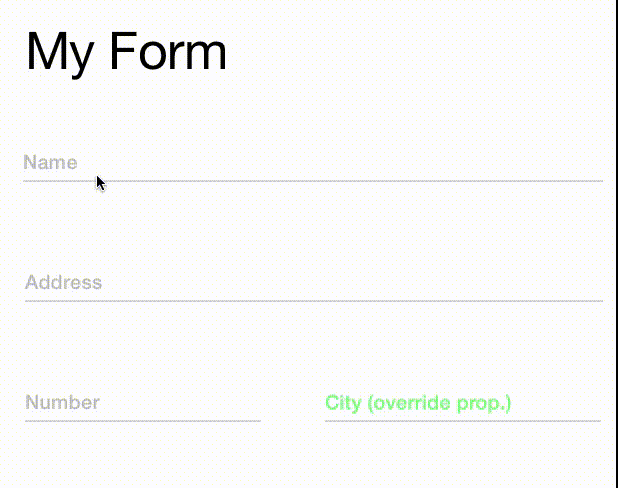

# SingleLineInput

[](https://travis-ci.org/Diogo Maximo/SingleLineInput)
[](http://cocoadocs.org/docsets/SingleLineInput)
[](http://cocoadocs.org/docsets/SingleLineInput)
[](http://cocoadocs.org/docsets/SingleLineInput)

## Demo


## Usage
To run the example project, clone the repo, and run `pod install` from the Example directory first.

## Installation
1- SingleLineInput is available through [CocoaPods](http://cocoapods.org). To install
it, simply add the following line to your Podfile:
```
pod "SingleLineInput"
```
2- Run 
```
pod update
```

3- Change your UITextField to SingleLineInput


4- Change SingleLineInput Properties (Optional)
```
_myInput.lineDisabledColor = [UIColor cyanColor];
_myInput.lineNormalColor = [UIColor grayColor];
_myInput.lineSelectedColor = [UIColor blueColor];
_myInput.inputTextColor = [UIColor redColor];
_myInput.inputPlaceHolderColor = [UIColor greenColor];
#OR use UIAppearance in your AppDelegate for change all inputs properties
[[SingleLineTextField appearance] setLineDisabledColor:[UIColor cyanColor]];
[[SingleLineTextField appearance] setLineNormalColor:[UIColor grayColor]];
[[SingleLineTextField appearance] setLineSelectedColor:[UIColor blueColor]];
[[SingleLineTextField appearance] setInputPlaceHolderColor:[UIColor greenColor]];
[[SingleLineTextField appearance] setInputFont:[UIFont boldSystemFontOfSize:18]];
[[SingleLineTextField appearance] setPlaceHolderFont:[UIFont boldSystemFontOfSize:16]];

```

## Author

Diogo Maximo, dcmaximo@gmail.com

## License

SingleLineInput is available under the MIT license. See the LICENSE file for more info.


